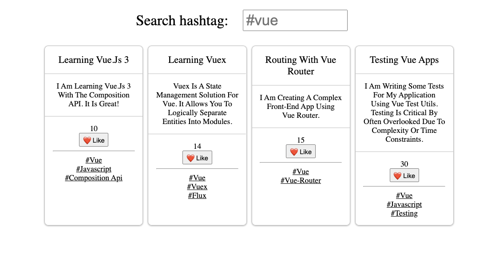

## Getting Started

```
yarn vite --config vite.config.js <project[Folder]Name>
```

Either clone master and `yarn install`, or start with `getting-started` and:

```sh
yarn add vue@3.0.7
yarn add vite@2.1.1 --dev
```

## Project: Microblog Application

Build a project using the Composition API to display posts and filter via hashtags. Build a global store.

- likes
- filter
- typing
- reusing components
- composables, global state
- design patterns

## Final view


